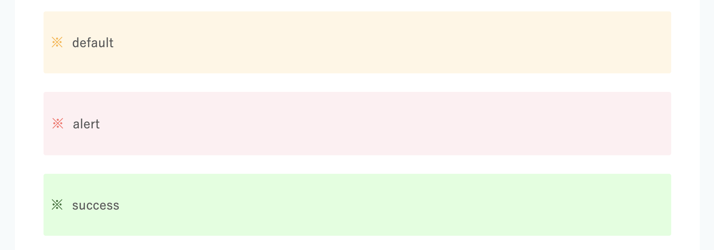

# neta

## Hugo
### required

- ruby >= 3.1
- go >= 1.6
- [cwebp](https://formulae.brew.sh/formula/webp)
- [tcardgen](https://github.com/Ladicle/tcardgen)

### setup
```shell
% cd hugo
% cp .env.example .env
% bundle install
```

```shell
% brew install webp
```

```shell
% go install github.com/Ladicle/tcardgen@latest
```

### create new post
```shell
% cd hugo
% ruby create_new_post.rb {issue_id}
```

### save post
```shell
% cd hugo
% ruby save_post.rb {issue_id}
```

### release
```shell
% cd hugo
% sh copy-posts.sh
% cd ..
% git add .
% git commit -m 'new post'
% git push
```

### attach labels
1. github issueにラベルをつける
2. ラベルを取り込んでhugoのタグにする
```shell
% cd hugo
% ruby import_meta {issue_id}

ex) ruby import_meta 88
```

### create eyecatch
```shell
% cd hugo
% tcardgen -c twitterCard/config.yaml \
           -f twitterCard/font/kinto-master/Kinto\ Sans \
           -o static/images/ogImage/106.png \
           content/posts/106.md
```

### short codes
#### image
```

```

画像は`hugo/content/images/{issue_id}`に配置する


必要に応じてwebp変換を行う
```
% brew install webp

ex) cwebp path/to/foo.png -o ./hugo/content/images/85/foo.webp
```

#### message
```

default



alert



success

```



## issues
検証したサンプルコードのディレクトリ
`issues/{issue_id}`ディレクトリで区別している


